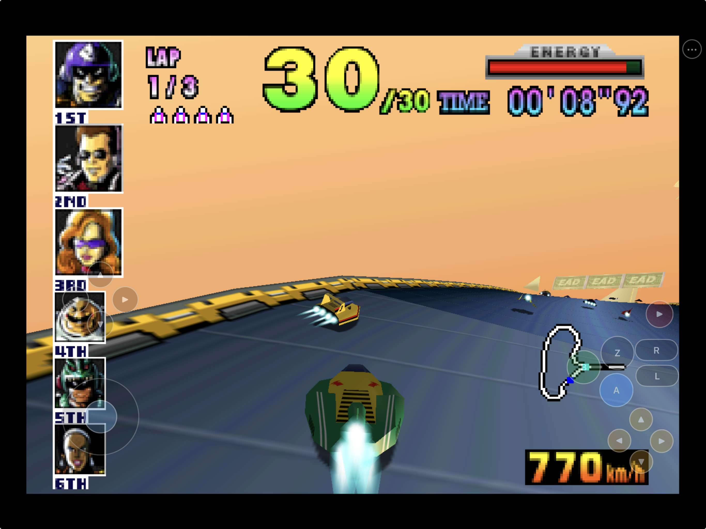
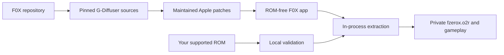

# F0X



<p align="center">
  <strong>F-Zero X rebuilt as a native Apple app.</strong><br>
  Metal rendering, local game-data setup, customizable touch controls, and
  support for keyboards and iOS-compatible game controllers.
</p>

<p align="center">
  <a href="https://www.buymeacoffee.com/chrissotraidis"></a>
</p>

<p align="center">
  
  
  
  <a href="docs/STATUS.md"></a>
  <a href="docs/BUILDING.md"></a>
  <a href="#install-status"></a>
  
</p>

<p align="center">
  <a href="#get-started">Build</a> ·
  <a href="#supported-game-data">Game data</a> ·
  <a href="#touch-controls">Touch controls</a> ·
  <a href="docs/STATUS.md">Status</a> ·
  <a href="docs/KNOWN_ISSUES.md">Known issues</a> ·
  <a href="docs/TESTING.md">Evidence</a>
</p>

F0X packages the native decompiled F-Zero X game logic from
[G-Diffuser](https://github.com/Zorkats/G-Diffuser) with
[libultraship/Fast3D](https://github.com/Zorkats/libultraship) and its Metal
backend. It is a source-port integration, not a general Nintendo 64 emulator.

This repository contains the Apple integration, maintained patches,
documentation, and original F0X artwork. It does **not** contain F-Zero X, a
ROM, extracted Nintendo assets, saves, or a playable ROM-derived archive. You
must supply your own legally acquired supported cartridge dump; setup and
extraction happen locally, and nothing is uploaded.

## Install status

| Option | Status | What to do |
|---|---|---|
| Public `.ipa` | **Planned; not published yet** | A public developer-preview IPA is planned, but no downloadable build has been published. |
| App Store / TestFlight | **Not announced** | F0X has no store listing or public TestFlight. |
| Local iPad build | **Owner-played and accepted** | The signed arm64 build has been installed, updated in place, and played on a physical 12.9-inch iPad Pro. Normal game start, touch racing, audio, and course presentation are accepted on that device. |
| Local iPhone build | **Installed; layout accepted** | The universal build is signed and running on a physical iPhone 14 with verified local game data. Its owner-arranged touch profile is now the independent phone default; broader phone gameplay testing continues. |
| iPhone/iPad Simulator | **Available for development** | The native arm64 app imports local game data, renders through Metal, and has completed touch/UI/race stability verification. Simulator evidence is not physical-device acceptance. |
| Apple Silicon macOS | **Available for development** | The native `F0X.app` builds, seals locally, imports game data, persists saves, and renders a live Metal race. |

F0X is close to a public developer preview, but it is not being presented as a
finished release. The current physical-iPad build is owner-accepted for normal
game start, touch gameplay, audio, course previews, and racing. The iPhone 14
layout is also owner-arranged and promoted to independent defaults; broader
phone gameplay testing continues. Headset/Bluetooth routes, lifecycle interruptions, thermals, physical
controllers, stress multi-touch, and long-session coverage remain open. See the exact
[evidence ledger](docs/STATUS.md) rather than inferring completion from a build
or Simulator screenshot.

## Get started

You need:

- an Apple Silicon Mac with Xcode and its command-line tools;
- CMake, Ninja, and Python 3;
- your own legally acquired supported F-Zero X ROM; and
- an Apple ID configured in Xcode if you intend to install on hardware.

Install the basic host tools with [Homebrew](https://brew.sh):

```sh
brew install cmake ninja python
```

Clone F0X and run the pinned-source setup. Generated sources and build products
live under ignored `ref/` and `build/`; maintained Apple changes stay
reviewable in `patches/`.

```sh
git clone https://github.com/chrissotraidis/f0x.git
cd f0x
scripts/setup-sources.sh
```

Build the Apple Silicon macOS app:

```sh
cmake -S ref/G-Diffuser -B build/macos-f0x-bundle -G Ninja \
  -DCMAKE_BUILD_TYPE=Debug \
  -DGDX_EXPANSION_KIT=OFF \
  -DGDX_MACOS_BUNDLE=ON \
  -DPython3_EXECUTABLE="$PWD/build/python-build-tools/bin/python"

cmake --build build/macos-f0x-bundle --target G-Diffuser --parallel 4
open build/macos-f0x-bundle/port/F0X.app
```

The iPhone/iPad Simulator and unsigned arm64 device recipes are in
[`docs/BUILDING.md`](docs/BUILDING.md). Device installation additionally
requires a development team, provisioning profile, controlled bundle ID, and
connected iPhone or iPad. Never commit signing material or team identifiers.

## First launch

F0X never downloads or bundles game data.

1. Open F0X and choose **Manage Game Data** or the first-run setup action.
2. Select your supported ROM with the native file picker.
3. F0X copies the file into its private container and validates its identity.
4. Choose **Build game data and continue**.
5. The in-process Torch pipeline creates and validates `fzerox.o2r` locally.
6. F0X activates the archive atomically and continues into the native game.

The verified iPad Simulator path completes selection, validation, in-process
extraction, hot mounting, and a visible race without starting a second app.
Archive-only relaunch also works after the original ROM is removed. Physical
device storage-pressure, interruption, invalid-input, and cancellation paths
still need hardware acceptance.

## Supported game data

| Property | Supported value |
|---|---|
| Game | F-Zero X |
| Region / revision | US revision 0 |
| Format | Big-endian `.z64` |
| Size | 16 MiB (`16,777,216` bytes) |
| SHA-1 | `5f658e88ffa9de23cba6986a8fd3d3a90d7b4340` |
| Local archive | `fzerox.o2r`, 3,610 records |

Byte-swapped `.v64` and `.n64` inputs are not currently advertised. Do not
open issues requesting ROMs, extracted archives, or download links.

## Touch controls

F0X uses an original UIKit touch controller adapted to F-Zero X rather than
simulating keyboard events. It writes atomic N64 pad state directly into port
1 and merges cleanly with a physical controller.

- **Left:** continuous analog steering, a separate D-pad, and the left
  slide/attack control.
- **Right:** accelerator, boost, brake, right slide/attack, camera, look-back,
  Start, and secondary controls.
- **Menu:** `•••` remains available whenever the game surface is active.
- **Settings:** use **Settings → Controls → Touch Controls** for visibility,
  controller auto-hide, haptics, opacity, and reset controls.
- **Customize:** move, resize, show, or hide controls in independent phone and
  tablet layouts; saved layouts survive relaunch. The owner-accepted physical
  iPad layout is the tablet default, and the separately arranged physical-iPhone
  profile is now the phone default. Reset or a clean install selects the correct
  device-class layout without changing an existing saved profile.
- **Input Editor:** the mobile-safe editor uses two balanced columns on iPad
  and one on iPhone, with every stick, rumble, gyro, and LED section reachable.

Opening Settings or the Input Editor releases and hides gameplay input. Closing
it restores a neutral controller state. The focused merge/profile suite passes
87 checks, and live iPad/iPhone Simulator verification covers visual layout,
menu/editor behavior, persistence, and a touch-driven route into a race.
Ordinary physical-iPad touch gameplay and the current tablet layout are owner-
accepted. Physical-iPhone geometry is accepted. Stress multi-touch, controller
handoff, haptic feel, and broader phone gameplay remain under test.

| Touch label | F-Zero X action |
|---|---|
| Analog stick | Steering and menu navigation |
| A | Accelerate / confirm |
| B | Boost / cancel |
| C↓ | Brake |
| Z / R | Left / right slide and attack inputs |
| C→ | Change camera |
| C↑ | Look back |
| Start | Start / pause |
| D-pad | Menus and editor functions |

## What works

| Area | Current evidence-backed result |
|---|---|
| Native runtime | Decompiled F-Zero X logic runs as host arm64 code; this is not an emulator frontend |
| Rendering | libultraship/Fast3D renders through Metal on Apple Silicon macOS, iOS Simulator, the owner-tested physical iPad, and the launched physical iPhone build |
| Game setup | Native picker, local validation, in-process extraction, atomic install, hot mount, and archive-only relaunch |
| Touch | Full control set, phone/tablet layouts, customization, persistence, safe cancellation, menu access, and controller auto-hide |
| Input Editor | Responsive iPhone/iPad layout with aligned mappings and unobstructed controls |
| Saves | Exact 32 KiB settings-SRAM write, relaunch, load, and reversal verified on macOS |
| Audio | Retail cartridge synthesis, corrected cartridge instrument mapping, 59.94 Hz mobile pacing, and SDL 32 kHz stereo transport; normal physical-iPad gameplay is owner-accepted, while the iPhone and alternate route/interruption matrix remain open |
| Course previews | The six rotating course maps use the host-compatible packed 0.25 model scale and are owner-accepted on the physical iPad |
| Physical iPhone | Signed build installed and running on iPhone 14; ROM/archive/save/control hashes and live archive/audio startup are verified, while hands-on play remains open |
| Diagnostics | Privacy-scrubbed runtime report and native Share sheet verified on macOS and iPhone Simulator |
| Stability | Converted display-list cache regression plus a 5:16 guarded Simulator race/transition soak with no crash |
| Packaging | Sealed local macOS bundle plus deterministic, ROM-free unsigned arm64 iPhoneOS IPA workflow |

Still open: physical-iPhone gameplay and layout acceptance, stress multi-touch,
route/interruption matrices, high-refresh and Low Power Mode behavior, release
signing/notarization, a human-completed macOS race on this host, and Expansion
Kit support.

## Reproducible and ROM-free



The compile never needs or packages your ROM. Repository and package audits
must reject original game media, derived playable archives, saves, credentials,
provisioning profiles, certificates, and signing keys. Exact pins and licenses
are recorded in [`docs/DEPENDENCIES.md`](docs/DEPENDENCIES.md).

## Frequently asked questions

<details>
<summary><strong>Where is the IPA?</strong></summary>

There is no public F0X IPA yet. A public developer preview is planned. The
unsigned arm64 iPhoneOS app compiles and
passes a ROM-free payload audit, and `scripts/package-ios.sh` creates a
deterministic re-signable proof artifact. A development-signed build has been
installed and tested in place on a physical iPad, but that local build is not a
public distribution. A future downloadable IPA must be independently audited
and described honestly before a release link appears here. See the
[build and package guide](docs/BUILDING.md#unsigned-re-signable-ipa).
</details>

<details>
<summary><strong>Does F0X include F-Zero X?</strong></summary>

No. You must provide your own legally acquired supported ROM. F0X does not
download, distribute, or upload game data.
</details>

<details>
<summary><strong>Does audio work?</strong></summary>

The corrected cartridge path produces continuous title-to-menu PCM in both LLE
and HLE. Normal physical-iPad gameplay is now owner-accepted. The key defect was a PORT-only
sound-font parser reading the instrument table four bytes late, so every request
selected the next instrument; correcting `+8` to the N64 header's `+4` restored
the intended menu music/effects. Physical-iPhone listening plus headphones,
Bluetooth, route changes, and interruption recovery remain hardware tests.
</details>

<details>
<summary><strong>Can I use a controller?</strong></summary>

SDL controller support and the existing libultraship mappings are compiled in,
and touch can auto-hide when a physical controller is visible. Physical iOS
controller gameplay, reconnect, rumble, and motion behavior still require a
device matrix.
</details>

<details>
<summary><strong>Is Expansion Kit content supported?</strong></summary>

Not in the current product build. F0X is cartridge-only while the core Apple
experience is completed and accepted. Expansion Kit work remains a separate
later gate and requires its own legally obtained inputs.
</details>

<details>
<summary><strong>Is this an official Nintendo release?</strong></summary>

No. F0X is an unofficial community integration and is not affiliated with or
endorsed by Nintendo or the upstream projects.
</details>

## Project map

| Path | Purpose |
|---|---|
| [`patches/`](patches/) | Maintained F0X changes replayed onto pinned upstream sources |
| [`assets/`](assets/) | Original F0X branding and Apple app-icon source assets |
| [`scripts/setup-sources.sh`](scripts/setup-sources.sh) | Clone exact upstream pins and apply the maintained series |
| [`scripts/apply-apple-baseline-patches.sh`](scripts/apply-apple-baseline-patches.sh) | Idempotent patch and app-icon setup |
| [`docs/BUILDING.md`](docs/BUILDING.md) | macOS, Simulator, and unsigned-device build recipes |
| [`docs/GAME_DATA.md`](docs/GAME_DATA.md) | Supported input and private-data lifecycle |
| [`docs/STATUS.md`](docs/STATUS.md) | Canonical evidence and completion ledger |
| [`docs/TESTING.md`](docs/TESTING.md) | Dated runtime and regression evidence |
| [`docs/KNOWN_ISSUES.md`](docs/KNOWN_ISSUES.md) | Open defects, limitations, and external blockers |
| [`docs/TOUCH_CONTROLS_IMPLEMENTATION.md`](docs/TOUCH_CONTROLS_IMPLEMENTATION.md) | Touch architecture, mappings, and acceptance contract |
| [`docs/NEXT_BUILDER.md`](docs/NEXT_BUILDER.md) | Exact continuation order for the next engineering run |
| [`ref/`](ref/) | Ignored, disposable source/reference area; only its policy README is tracked |

Generated source trees, build directories, ROMs, archives, saves, diagnostic or
private captures, and signing material must never be committed. The promotional
gameplay image above was explicitly approved by the owner for public use.

## Contributing and support

Please include exact platform, build SHA, reproduction steps, and a privacy-
scrubbed diagnostic report with defect reports. Never attach game data, private
paths, signing material, or ROM-derived files. Check
[`docs/KNOWN_ISSUES.md`](docs/KNOWN_ISSUES.md) before opening a duplicate issue.

## Legal and acknowledgements

F0X is an unofficial community project. It does not provide the game, ROM
downloads, Expansion Kit disks, or playable ROM-derived data. Nintendo and
F-Zero are trademarks of Nintendo; all game copyrights and trademarks belong
to their respective owners.

F0X builds on G-Diffuser, libultraship/Fast3D, Torch, the F-Zero X matching
decompilation project, SDL, and their contributors. Each upstream component
retains its own license and copyright. See
[`docs/LEGAL_AND_PROVENANCE.md`](docs/LEGAL_AND_PROVENANCE.md) for the scoped
rights and provenance boundary.
